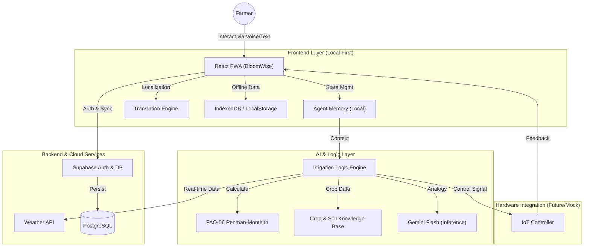

# BloomWise: Smart Irrigation AI Agent for Indian Farmers

## 🚀 Project Overview
**BloomWise** is an AI-powered smart irrigation scheduler designed specifically for Indian agriculture. It moves beyond generic weather apps by creating hyper-localized, crop-specific irrigation plans that respect India's diverse linguistic, climatic, and soil conditions. By bridging the gap between complex agronomy and simple farmer interactions, BloomWise empowers small-scale farmers to save water and improve yields.

---

## 🏗️ Architecture
The system follows a **Local-First, AI-Driven Architecture** designed for low-connectivity environments typical of rural India.

---

## 🎯 Problem Statement
India faces a critical water crisis, with agriculture consuming **80-90%** of freshwater resources. Traditional flood irrigation wastes **30-50%** of this water.
-   **Information Gap**: Farmers lack access to scientific data like Evapotranspiration (ET0).
-   **Language Barrier**: Most agri-tech solutions are in English, alienating 90% of Indian farmers.
-   **Connectivity**: Rural internet is often intermittent, making cloud-only apps unreliable.

## 💡 The Solution: BloomWise
BloomWise is a **"Farmer-First" AI Agent** that acts as a 24/7 agronomy expert.
1.  **Hyper-Local Intelligence**: Custom irrigation schedules based on specific crop (Wheat, Rice, Cotton), soil type (Alluvial, Black, Red), and real-time local weather.
2.  **Linguistic Inclusivity**: Full support for **12 Indian Languages** (Hindi, Tamil, Telugu, Marathi, etc.) with transliteration.
3.  **Agentic Workflow**: It doesn't just show data; it *makes decisions*. The AI proactively suggests: *"Skip irrigation tomorrow due to expected rain."*
4.  **Hardware Ready**: Designed to interface with IoT valves for automated control (simulated in MVP).

## ✨ Key Features
-   **Weekly Water Report**: Visual analytics showing liters saved and percentage efficiency.
-   **Smart Scheduling**: Dynamic calendar adapting to rain forecasts and crop growth stages.
-   **Voice-Ready Chat Interface**: "WhatsApp-style" chat for natural interaction with the AI agent.
-   **Offline Capabilities**: Essential schedules cached for use without internet.
-   **Community & Leaderboard**: Gamification to encourage water-saving practices among regional farmers.

## 🛠️ Tech Stack
-   **Frontend**: React.js, Vite, TailwindCSS (Custom Design System)
-   **Backend / Database**: Supabase (PostgreSQL, Auth)
-   **AI / Intelligence**: Google Gemini Flash (for reasoning and crop advice), Custom Agronomy Algorithms (FAO-56)
-   **APIs**: OpenMeteo (Weather), Supabase Auth (OTP)

---

## � Codebase Structure & File Purposes

A detailed breakdown of the purpose of each file in the codebase.

### Core Application
*   **`src/main.jsx`**: The entry point. Boostraps React and mounts the app to the DOM.
*   **`src/App.jsx`**: The main application shell. Handles routing (React Router), manages global state (User, Farm, Theme, Language), and enforces the "Registered vs Guest" logic.
*   **`src/index.css`**: The Global Stylesheet. Contains the **Glassmorphism Design System**, CSS variables for themes (Light/Dark), and global utility classes (`.btn`, `.card`, `.glass`).

### Components (UI)
*   **`src/components/LandingPage.jsx`**: The "Welcome Screen". First point of contact, featuring the branded Logo, Tagline, and options to Register, Sign In, or Preview.
*   **`src/components/Dashboard.jsx`**: The central Hub. Displays critical daily info: crop status, irrigation advice ("Irrigate Now/Wait"), power availability, and weather summary.
*   **`src/components/WhatsAppChat.jsx`**: The Core AI Interface. A WhatsApp-like chat UI where farmers talk to the agent. Renders markdown messages, handles tools, and manages tool-usage indicators ("Thinking...").
*   **`src/components/Navigation.jsx`**: The Bottom Navigation Bar. Provides quick access to Home, Chat, Simulation, Reports, and Settings. Handles standard & preview routing.
*   **`src/components/FarmerRegistration.jsx`**: The Onboarding Form. Collects farmer name, state, district, language, and initial farm setup (multilingual).
*   **`src/components/FarmSetup.jsx`**: Detailed configuration page for editing farm details (Soil type, Crop type, Sowing date, Size).
*   **`src/components/IrrigationSchedule.jsx`**: The "Planner" view. Visualizes the AI-generated 7-day irrigation schedule (Water droplets, timelines).
*   **`src/components/WeeklyReport.jsx`**: The "Analytics" view. Shows water saved (liters), tanker equivalents, and irrigation history.
*   **`src/components/SignalHistory.jsx`**: Currently the "Simulate" page. Allows debugging/demoing by jumping forward in time or simulating weather events.
*   **`src/components/Settings.jsx`**: User Preferences. Handles Language switching (12 languages), Theme toggling (Light/Dark), and Data management (Clear Cache/Logout).
*   **`src/components/Icons.jsx`**: Custom Icon Library. Contains all SVG icons (Agent Logo, Crops, Weather, UI controls) optimized for the theme's `currentColor` behavior.
*   **`src/components/OfflineIndicator.jsx`**: A subtle UI banner that appears when the internet disconnects, reassuring the user that the "Offline Agent" is active.
*   **`src/components/WeatherCard.jsx`**: A reusable component to display detailed weather metrics (Temp, Humidity, Rain chance).

### Services (Logic & AI)
*   **`src/services/agentLoop.js`**: The **Brain**. Implements the ReAct (Reason+Act) loop. It takes user input, decides which tool to use, executes it, and generates the final response.
*   **`src/services/agentTools.js`**: The **Hands**. Defines the executable tools: `calculate_irrigation`, `get_weather`, `get_power_schedule`, etc. Contains the agricultural logic (Kc values, soil moisture math).
*   **`src/services/agentMemory.js`**: The **Long-term Memory**. Manages conversation history constraints (keeping the context window efficient) and stores key facts about the farm.
*   **`src/services/geminiService.js`**: The **Voice**. Wraps the Google Generative AI SDK to communicate with the Gemini Flash 1.5 model.
*   **`src/services/weatherService.js`**: The **Eyes**. Fetches real-time weather data from OpenMeteo APIs (Historic for past, Forecast for future).
*   **`src/services/supabase.js`**: The **Cloud Storage**. Connects to the Supabase backend for saving user profiles and farm data (when online).
*   **`src/services/offlineManager.js`**: The **Cache**. Intercepts data requests. If offline, serves cached weather/farm data. If online, fetches and saves to cache.
*   **`src/services/signalService.js`**: Utility for simulation signals (demo purposes).

### Data (Static Knowledge)
*   **`src/data/indianCrops.js`**: Database of 60+ Indian crops. Contains Crop Coefficients (Kc) for different growth stages and seasons (Kharif/Rabi/Zaid).
*   **`src/data/indianSoils.js`**: Database of 8 major Indian soil types. Contains moisture retention properties and field capacity data.
*   **`src/data/powerSchedules.js`**: Logic for Indian rural 3-phase power availability (Morning/Evening/Night slots) used for irrigation timing.
*   **`src/data/weatherData.js`**: Fallback/Mock weather data used during development or deep offline modes.

### Utilities
*   **`src/utils/translations.js`**: The Rosetta Stone. Contains the entire app's text strings translated into 12 Indian languages.
*   **`vite.config.js`**: Build configuration for the Vite bundler.
*   **`.env` / `.env.example`**: Environment variables (API Keys, URLs).

---

## �📸 Screen Previews
*(Placeholders for Hackathon Deck)*
1.  **Welcome & Auth**: Multilingual onboarding with Email/OTP login.
2.  **Dashboard**: Immediate status ("Irrigate Now" vs "Wait") and weather summary.
3.  **Weekly Report**: Detailed water usage analytics.
4.  **Chat Agent**: Conversational advice in native languages.

---

## 🌍 Impact
-   **Water Conservation**: Potential to drive water usage down by **20-30%** via precision scheduling.
-   **Economic Growth**: Reduced input costs (water/diesel) and higher yields through optimized moisture.
-   **Digital Inclusion**: Bringing AI benefits to the grassroots level in a language farmers understand.
